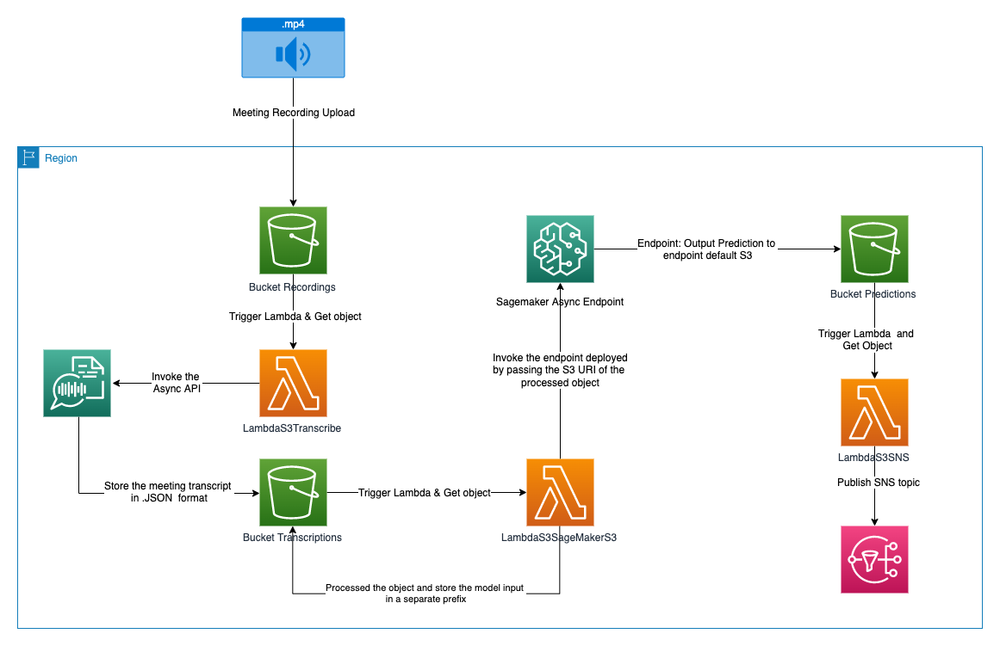

# AI-Generated Conversation Summary leveraging Hugging Face Containers for Amazon Bedrock and Amazon Transcribe




---

## What is the Problem being addressed in this Project ?

The 2022 employee has to attend a high amount of virtual meetings on a daily basis - making it overwhelming to remember all of the important discussed topics. One option is to manually write down meeting minutes, which nonetheless greatly reduces the employee's ability to pay attention. Instead it would be more effective if the meeting was automatically summarised leveraging technologies such as Machine Learning and Natural Language Processing. That way, every attendee can focus on the conversation while still being able to check on discussed topics on a summarised transcript at a later point in time.


## What is the proposed Solution?

This project showcases how to summarise a discussion from a virtual meeting (eg. through Amazon Chime) with several participants. The only prerequisite is a recording of the meeting in .mp4 format. Once the recording has been uploaded to an S3 bucket, a Lambda function (LambdaS3Transcribe) invokes the Amazon Transcribe API to transform the recording into the meeting transcript. Subsequently, another Lambda function (LambdaS3SageMaker) invokes an asynchronous SageMaker Endpoint, which will generate a meeting summary based on the google/pegasus-large model from Hugging Face, and store it in another S3 bucket. In the last step, the summary is sent to the meeting attendees through an Amazon SNS topic. As you can see from the architecture diagram, we use S3 bucket to decouple our architecture. 

## How can this Project be used?

This project provides Infrastructure-as-Code (IaC) scripts based on AWS CDK written in python language. This can be used to deploy all resources to a specified account and region and allows to test the application only within a few minutes. If you haven't used CDK before checkout the AWS developer guide https://docs.aws.amazon.com/cdk/v2/guide/home.html and make sure to install the CDK library and toolkit. A clear set of guidelines for deploying the stack are provided below under **How to deploy the CDK Stack ?**

### How to setup your Coding Environment?

1. Download latest version of Python 3: https://www.python.org/downloads/
2. Download Visual Studio Code: https://code.visualstudio.com
3. Clone the git repository: https://gitlab.aws.dev/sentichime/text-summarization.git

### How to deploy the CDK Stack?

**Prerequisites:** AWS CLI v2, AWS CDK, Unix machine (recommended)

"cd" into the infrastructure directory 

```
cd infrastructure/
```

Add email addresses which will receive the meeting summary

```
edit infrastructure/email_addresses.json, and add a list of mail addresses
```

Setup your virtual environment using python:
```
python3 -m venv .venv
```

Activate the virtual environment: 
```
source .venv/bin/activate
```

Install the required packages:
```
pip install -r requirements.txt
```

Validate the AWS credentials through AWS CLI:
```
aws configure 
```

If you run cdk for the first time in the account and region you specified, you need to bootstrap cdk first:
```
cdk bootstrap
```

At this point you can now synthesize the CloudFormation template for this code:
```
cdk synth
```

When making infrastructure adjustments you can check the differences before deploying by running the cdk diff command:
```
cdk diff
```

To deploy the content you can run the cdk deploy command:
```
cdk deploy
```

In order to destroy the stack, you can call the cdk destroy command:
```
cdk destroy
```

### How to test the Application ?
In order to allow for rapid testing of the application a simple .mp4 file has been provided which captures a conversation between 2 people recorded on Amazon Chime. The data is stored under the data/ directory. Before running the application it is necessary to first specify the email address which will subscribe to the SNS topic and hence receive the meeting summary. 

This can be done by running the command below and replacing the placeholder email address with your own.

```
cdk deploy --parameters ParticipatorEmailAddress=<placeholder-email-address>
```

Once that has been done the mp4 file must be uploaded to the S3 **BucketRecordings \<Random numbers added by CDK\>**  bucket, which will trigger the application.
