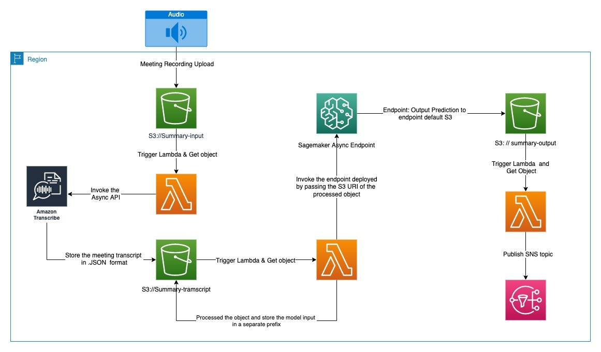

# Text Summarization




---

## What is the Problem being addressed in this Project ?

The vast amount of virtual meetings an AWS employee has to attend on a daily basis can be overwhelming and makes it difficult to remember all of the important aspects that have been discussed. One option to handle this issue is to manually take notes during the meeting which nonetheless greatly reduces the capacity to pay attention and hence renders it suboptimal. Instead it would be more effective if the meeting would be automatically summarized leveraging technologies such as Machine Learning and Natural Language Processing. That way every attendee can pay attention to the conversation in the meeting while still being able to check on certain discussed topics on a summarized transcript at a later point in time. 

This project aims at providing a minimum viable solution for the aforementioned problem mostly using serverless AWS Services as exhibited above in the Architecture Diagram.

## What is the proposed Solution?

In this project an application, which is able to summarize a discussion from a virtual meeting (eg. through Amazon Chime) with several participants has been developed. The only prerequisite is a recording of the meeting in .mp4 format. Once the recording has been uploaded to an S3 bucket, it will trigger a Lambda function that will invoke the Transcribe API to transform the recording into the meeting transcript. Subsequently another Lambda function invokes an asynchronous SageMaker Endpoint, which will generate several segments of summary (2000 characters max for each segment) and store it in another S3 bucket. In the last step, the summarised transcript is sent to the meeting attendees through SNS. We used S3 buckets to decouple our architecture.

## How can this Project be used?

This project provides Infrastructure-as-Code (IaC) scripts based on AWS CDK written in python language. This can be used to deploy all resources to a specified account and region and allows to test the application only within a few minutes. If you haven't used CDK before checkout the AWS developer guide https://docs.aws.amazon.com/cdk/v2/guide/home.html and make sure to install the CDK library and toolkit. A clear set of guidelines for deploying the stack are provided below under **How to deploy the CDK Stack (Mac OS) ?**

### How to setup your Coding Environment?

1. Download latest version of Python 3: https://www.python.org/downloads/
2. Download Visual Studio Code: https://code.visualstudio.com
3. Clone the git repository: https://gitlab.aws.dev/sentichime/text-summarization.git

### How to deploy the CDK Stack (Mac OS)?

"cd" into the infrastructure directory 

```
cd infrastructure/
```

Add email addresses which will receive the meeting summary

```
edit infrastructure/email_addresses.json, and add a list of mail addresses
```

Setup your virtual environment using python:
```
python3 -m venv .venv
```

Activate the virtual environment: 
```
source .venv/bin/activate
```

Install the required packages:
```
pip install -r requirements.txt
```

Validate the AWS credentials through AWS CLI:
```
aws configure 
```

If you run cdk for the first time in the account and region you specified, you need to bootstrap cdk first:
```
cdk bootstrap
```

At this point you can now synthesize the CloudFormation template for this code:
```
cdk synth
```

When making infrastructure adjustments you can check the differences before deploying by running the cdk diff command:
```
cdk diff
```

To deploy the content you can run the cdk deploy command:
```
cdk deploy
```

In order to destroy the stack, you can call the cdk destroy command:
```
cdk destroy
```

### How to test the Application ?
In order to allow for rapid testing of the application a simple .mp4 file has been provided which captures a conversation between 2 people recorded on Amazon Chime. The data is stored under the data/ directory. Before running the application it is necessary to first specify the email address which will subscribe to the SNS topic and hence receive the meeting summary. This can be done by updating the entry in **email_addresses.json** file. Once that has been done the mp4 file must be uploaded to the S3 **BucketRecordings \<Random numbers added by CDK\>**  bucket, which will trigger the application.
